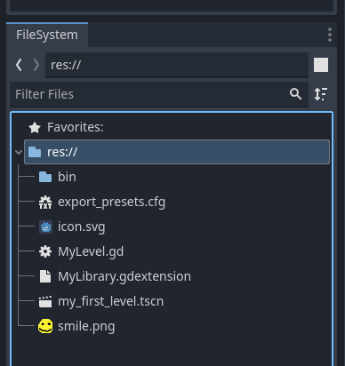
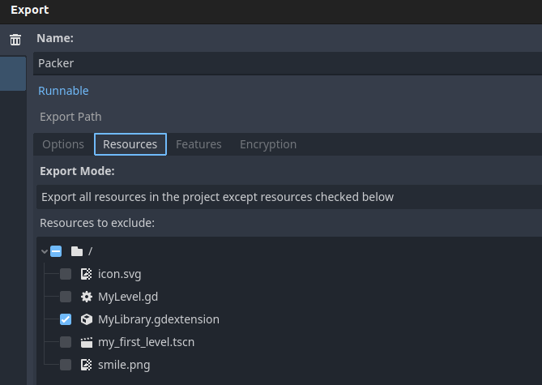

# Resource Pack Example


This repo demonstrates how you can load your resources (images, `.tscn` files, etc) in a `SwiftGodotKit` project using `res://` paths you're familiar with in `gdscript`.

```swift
guard let myFirstLevelPackedScene: PackedScene = GD.load(path: "res://my_first_level.tscn"),
      let myFirstLevel = myFirstLevelPackedScene.instantiate() as? MyLevel else {
    fatalError("could not load res://my_first_level.tscn")
}
```

## Overview

You must have a godot project where you import your resources, they must have been imported at least once. See [MyProject/](./MyProject/)



Export the `MyGame.pck` file of your resources, in the same way Godot would when exporting your project. See `pack` in [Makefile](./Makefile)

**IMPORTANT!**: update the makefile with the path to _your_ Godot 4 executable
```bash
path/to/godot4 --headless --path ./MyProject --export-pack Packer ../Sources/MyGame/Resources/MyGame.pck
```

Include this `MyGame.pck` resource in your `.executableTarget` using `.copy`. See [Package.swift](./Package.swift)

```swift
.executableTarget(
    name: "MyGame",
    dependencies: [
        "SwiftGodotKit",
        "MyLibrary"
    ],
    resources: [
        .copy("Resources/MyGame.pck") // <-- use `.copy`
    ]
)
```

Pass the path to the pack file as a launch argument to godot when calling `runGodot`. See `main()` [Sources/MyGame/main.swift](./Sources/MyGame/main.swift)

```swift
private func main() {
    guard let packPath = Bundle.module.path(forResource: "MyGame", ofType: "pck") else {
        fatalError("Could not find path for Resource.pck")
    }
    
    runGodot(
        args: [
            "--main-pack", packPath,
        ],
        initHook: registerTypes,
        loadScene: loadScene,
        loadProjectSettings: { projectSettings in
            print(projectSettings)
        },
        verbose: true
    )
}
```

## Other things

If I recall correctly, you must exclude the .gdextension file in the export. See `export_files=PackedStringArray("res://MyLibrary.gdextension")` in [MyProject/export_presets.cfg](./MyProject/export_presets.cfg), to avoiding having two instances of your libraries running at the same time. Been a while since I verified this.

